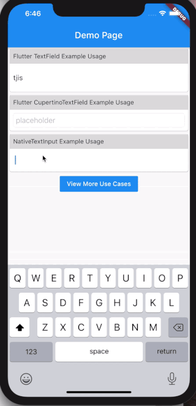

# Native Text Input for Flutter

A text input widget built with the use of `UITextView` for supporting native text view features. This package supports iOS only for now.

## Installation

https://pub.dev/packages/flutter_native_text_input/install

## Why using this?

**Autocorrect tooltips don't appear on iOS**
(https://github.com/flutter/flutter/issues/12920)

Many iOS users have established a habit for using convenience features of native `UITextView`. No doubt that Flutter provides a lot of useful widgets. However, most Flutter developers should notice that `TextField` or `CupertinoTextField` provided by Flutter are not using native UI components and hence text input experience becomes different.

Regarding this, this package aims to simply provide the interface to other developers to use native `UITextView` directly in your Flutter app.

The above is just showing one of missing features comparing Flutter `TextField` from native `UITextView`, there are some others your app users may find text inputs in your Flutter apps are different from others apps. Those features would be important if you are developing apps which involve composing a text message, messaging app for example.

Hope you find it useful! Enjoy coding 🎉🎉🎉

## Plugin API

| Name            | Type          | Description                    | Default                  |
|:----------------|:--------------|:-------------------------------|:-------------------------|
| `controller`      | TextEditingController  | Controlling the text being edited (https://api.flutter.dev/flutter/material/TextField/controller.html) | null |
| `placeholder`     | String                 | Placeholder text when text entry is empty (https://api.flutter.dev/flutter/cupertino/CupertinoTextField/placeholder.html) | null |
| `textContentType` | TextContentType        | To identify the semantic meaning expected for a text-entry area (https://developer.apple.com/documentation/uikit/uitextcontenttype) | null |
| `keyboardType`    | KeyboardType           | Type of keyboard to display for a given text-based view (https://developer.apple.com/documentation/uikit/uikeyboardtype) | KeyboardType.defaultType |
| `onChanged`       | ValueChanged\<String>  | Called when the user initiates a change to text entry (https://api.flutter.dev/flutter/material/TextField/onChanged.html) | null |
| `onSubmitted`     | ValueChanged\<String>  | Called when the user indicates that they are done editing the text in the field (https://api.flutter.dev/flutter/material/TextField/onSubmitted.html) | null |
| `focusNode`       | FocusNode              | Defines the keyboard focus for this widget (https://api.flutter.dev/flutter/material/TextField/focusNode.html) | null |
| `textAlign`       | TextAlign              | How the text should be aligned horizontally (https://api.flutter.dev/flutter/material/TextField/textAlign.html) | TextAlign.start |
| `minLines`        | int                    | Minimum number of lines of text input widget | 1 |
| `maxLines`        | int                    | Maximum number of lines of text input body, 0 for no limit | 1 |

## More examples

You may find some example usages below:

https://github.com/henryleunghk/flutter-native-text-input/blob/master/example/lib/more_page.dart

## License

This project is licenced under the [MIT License](https://opensource.org/licenses/mit-license.html).
